<div align="center">

# Omarchy Cyberpunk

**Bring Night City to your Omarchy desktop.**

Neon accents. Angular interfaces. A Cyberpunk setup you control.


<a href="docs/media/desktop.png">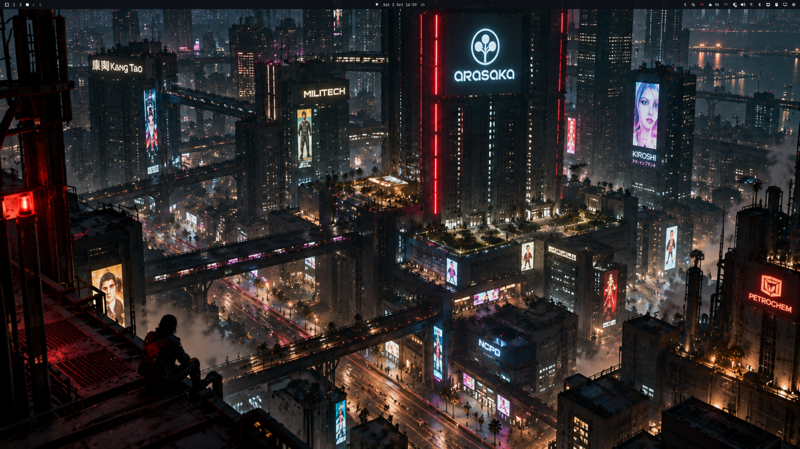</a>

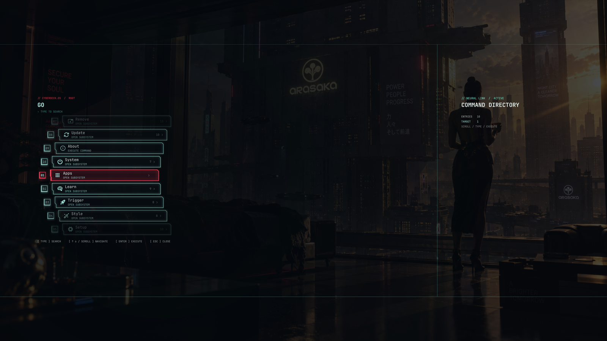

*Omarchy's native foundations. Your own Cyberpunk component mix.*

</div>

## // The desktop, in red and turquoise

Cyberpunk-inspired presentation built around **Omarchy's native shell and theme
picker**. The palette, menu and authentication surfaces share the same visual
language: angular frames, curved HUD rows, translucent red fields, turquoise
highlights and frozen-background signal faults.

## // Showcase

<table>
  <tr>
    <td width="50%" align="center"><b>Command HUD · 06</b><br><a href="docs/media/menu.png">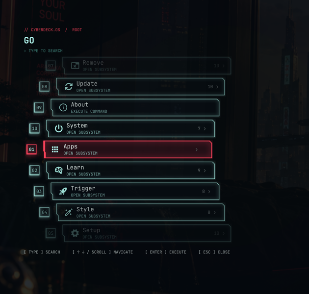</a></td>
    <td width="50%" align="center"><b>Apps · 07</b><br><a href="docs/media/apps.png">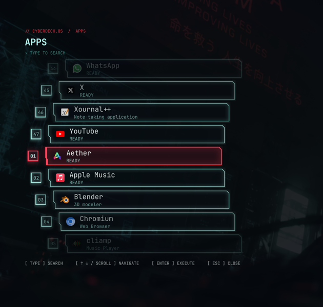</a></td>
  </tr>
  <tr>
    <td align="center"><b>Keybindings · 09</b><br><a href="docs/media/keybindings.png">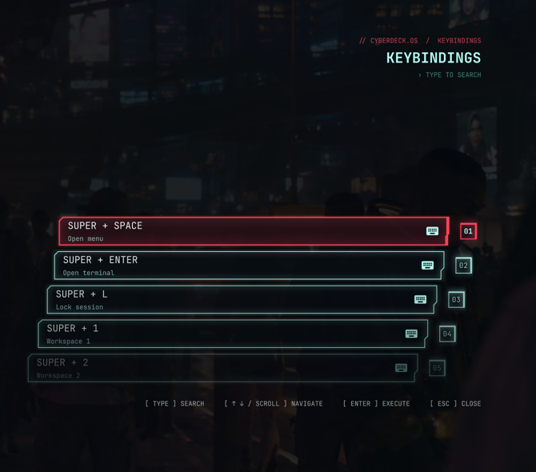</a></td>
    <td align="center"><b>Notifications · 10</b><br><a href="docs/media/notifications.png">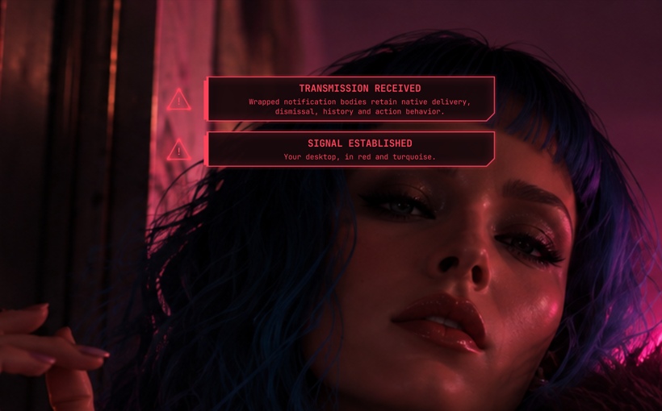</a></td>
  </tr>
  <tr>
    <td align="center"><b>Volume · 12</b><br><a href="docs/media/volume.png"></a></td>
    <td align="center"><b>Mute · 12</b><br><a href="docs/media/mute.png"></a></td>
  </tr>
</table>

### In motion

<table>
  <tr>
    <td width="50%" align="center"><b>Menu navigation</b><br>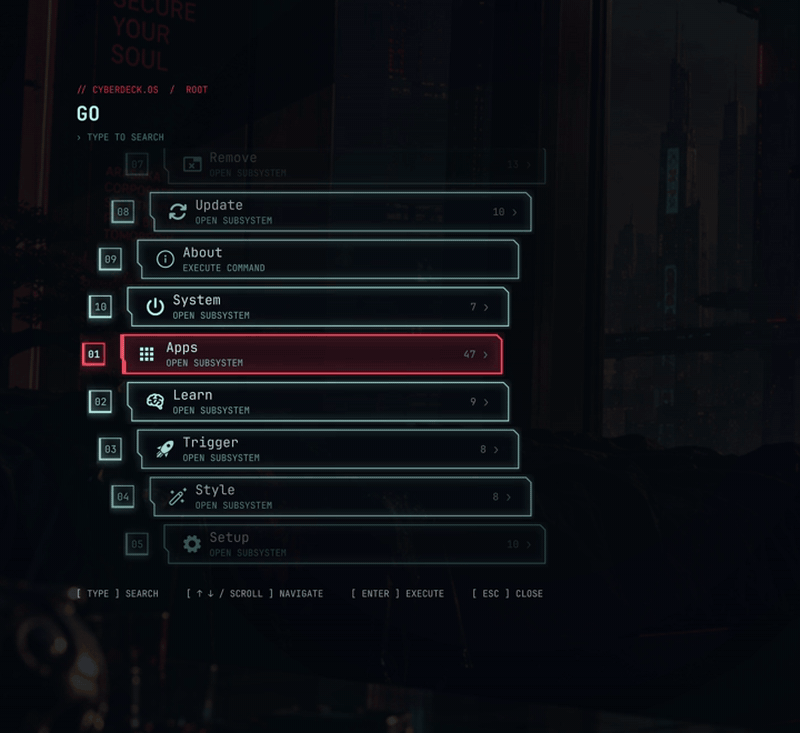</td>
    <td width="50%" align="center"><b>Authentication signal faults</b><br>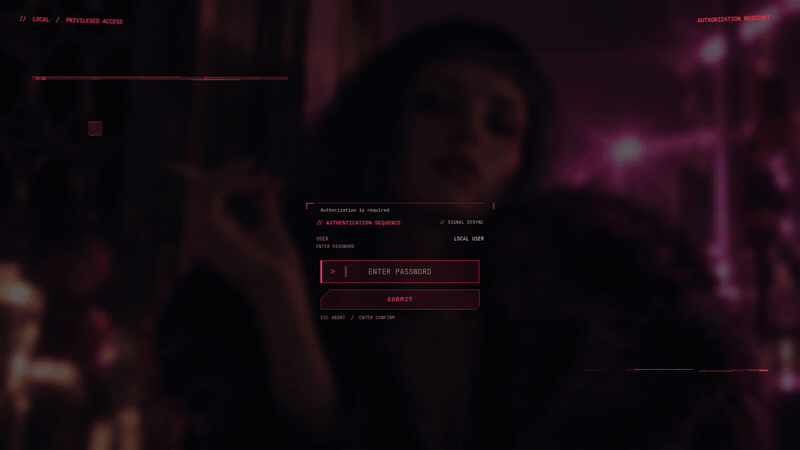</td>
  </tr>
</table>

### Matching authentication

<table>
  <tr>
    <td width="33%" align="center"><b>Session lock · 12</b><br><a href="docs/media/lock.png">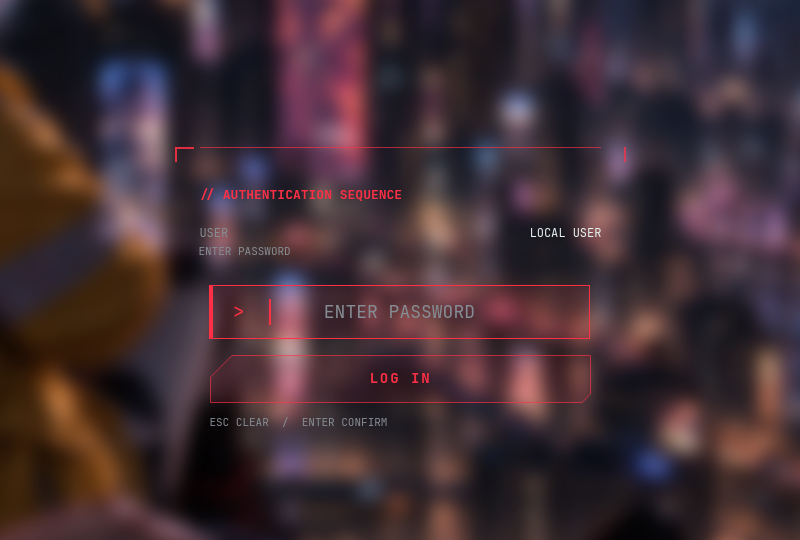</a></td>
    <td width="33%" align="center"><b>Sudo · 09</b><br><a href="docs/media/sudo.png">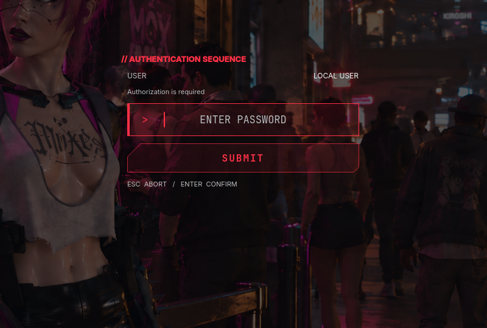</a></td>
    <td width="33%" align="center"><b>Polkit · 10</b><br><a href="docs/media/polkit.png">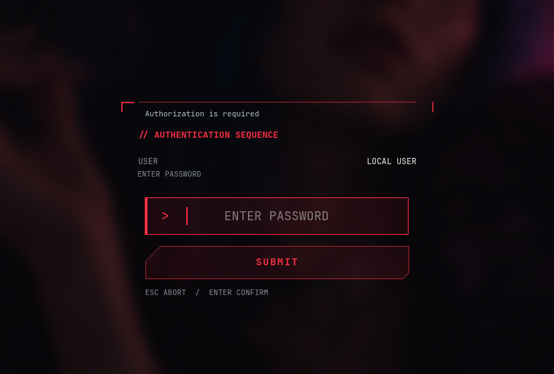</a></td>
  </tr>
</table>

The opening desktop shot shows the live Omarchy bar with the author's configured
widgets; bar layout and third-party widgets are personal choices, not bundled defaults.
Component views are actual QML captured in a clean private preview session;
shortcut rows and notifications use illustrative data. Auth views are offline
appearance demos, with no real credentials or authentication requests. Optional
components are shown enabled for the showcase; **fresh installs are base-only**.

[Full-resolution motion clips and reproduction details →](docs/media/README.md)

## // Components

| Component | What you get |
| --- | --- |
| **Desktop** | Palette-derived shell colors, directional window borders and 13 bundled wallpapers. |
| **Menu** | Curved command/App rows, search, stable hover, wheel navigation and mirrored Keybindings. |
| **Notifications** | Warning icon, stepped joined frames, wrapping message reveal and animated dismissal; native DND, history and actions. |
| **OSD** | Turquoise volume, red mute and centered action messages; native brightness, media and microphone payloads. |
| **Sudo / Polkit** | Frozen/dimmed backdrop, beveled password masks, a single padded red caret and cut-corner actions. |
| **Session lock** | Matching wallpaper/prompt and a brief settling effect, with pinned native PAM and secure session-lock handling. |

Sudo/Polkit shuffle 0.85/1.10/1.40-second fault sequences with varied pauses.
`OMARCHY_REDUCED_MOTION=1` suppresses their cosmetic loops. Passwords stay in the
native authentication flow; diagnostic IPC and review captures do not carry them.

## // Wallpapers

[`theme/backgrounds/`](theme/backgrounds/) contains the author's **13 generated
wallpapers**, copied without resizing or recompression:

```text
01.png  02.png  03.png  04.png  05.png  06.png  07.png
08.png  09.png  10.png  11.png  12.png  13.png
```

All bundled wallpapers are **1672 × 941**, copied byte-for-byte from the supplied
files. Numbering preserves their order in Omarchy's
background picker. **`01.png` is the installation default** and the source for the
theme thumbnail and offline auth previews.

<a href="docs/media/wallpapers.png">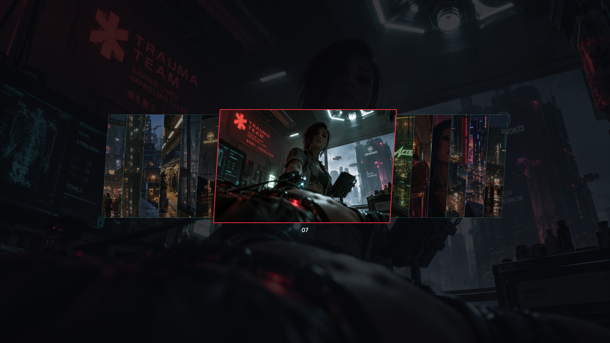</a>

Use **Style → Background** in the Omarchy menu, or cycle with:

```sh
omarchy theme bg next
```

Additional personal backgrounds can go in `~/.config/omarchy/backgrounds/cyberpunk/`.
Omarchy includes those alongside the bundled collection.

## // Requirements

- **Omarchy 4.0.4-1** in a running Hyprland/Wayland session.
- Omarchy's Quickshell/Qt 6 environment, Python/PySide6, Bash, `jq`, `flock` and `grim`.
- An unlocked, PAM-ready session with stock menu, Polkit, notifications, OSD and
  lock plugins enabled before first installation.
- `curl` for release installation and updates.

Pillow, FFmpeg and ImageMagick are only needed for development preview/thumbnail tooling.

The session-lock generator checks the inspected upstream release. An Omarchy
update that changes that contract needs review before custom-lock activation.

## // Install

Install the latest versioned release with one command, as your desktop user:

```sh
curl -fsSL https://raw.githubusercontent.com/LightQv/omarchy-cyberpunk/main/install.sh | bash
cyberpunk status
cyberpunk check
```

**No Git checkout or sudo required.** The bootstrap downloads a tagged GitHub release,
verifies its SHA-256 checksum and file manifest, installs it, and removes the temporary
download. Existing checkout installations migrate with their saved choices preserved.

| Installed content | Location |
| --- | --- |
| Theme and wallpapers | `~/.config/omarchy/themes/cyberpunk/` |
| Optional plugins | `~/.config/omarchy/plugins/lightqv.cyberpunk-*/` |
| CLI and shared support code | `${XDG_DATA_HOME:-~/.local/share}/omarchy-cyberpunk/` |
| Command | `~/.local/bin/cyberpunk` |
| Preferences, lock safeguards and release recovery | `${XDG_STATE_HOME:-~/.local/state}/omarchy-cyberpunk/` |

Theme and plugin directories contain installed files, not links to a development
checkout. Shared support code stays installed until uninstall. Ensure `~/.local/bin/`
is on your `PATH`. Open a new terminal or source `~/.bashrc` after installation.

```sh
cyberpunk version
cyberpunk update
```

Repeated installation of the same release validates it without changing installed
files or desktop settings. Updates preserve component
preferences, the selected theme and wallpaper. Edited or added project files are
protected: preserve your changes and restore the release files before updating or
removing. Interrupted transactions retain a private recovery journal; rerun the
installer while unlocked to recover and retry.

This initial release targets the inspected Omarchy version; pristine live
new-user/machine installation remains a qualification under **Status and development**.

<details>
<summary>Installation details</summary>

Installation adds an exact interactive-Bash sudo stanza and desktop
`theme-set`/`post-boot` reconciliation hooks. Theme selection can restart OpenCode.

First install creates a private baseline at
`~/.local/state/omarchy-cyberpunk-backup/{shell.json,bashrc,modes.json}`.
Existing complete baselines are retained. Incomplete/untrusted baselines and
occupied foreign paths are refused before installation changes the desktop.

</details>

## // Usage and customization

Select **Cyberpunk** through Omarchy's normal theme picker. Other themes restore
native desktop services. The project follows your existing Omarchy keybindings.

### One command, six optional components

**Fresh installation is base-theme only:** palette, wallpapers and borders with
native menu, notifications, OSD, sudo, Polkit and lock presentation. Enable the
components you want from any directory:

```sh
cyberpunk --help
cyberpunk list
cyberpunk status
cyberpunk enable menu
cyberpunk disable menu
cyberpunk enable all
cyberpunk disable all
```

Toggle names: `menu`, `notifications`, `osd`, `sudo`, `polkit`, `lock` — or `all`.

`--help` explains the commands and gives examples. `list` describes the toggleable
components; `status` reports your saved choices and actual providers. Help, list,
status and check are read-only.

**Enable** selects Cyberpunk presentation; **disable** restores native
presentation while keeping the functionality available. `osd` includes the volume,
mute, brightness, microphone and media popups. The audio panel/bar widget remains
independent of this project.

`all` updates all six preferences together. These commands do not select a theme.
Switching to a native theme uses native components; switching back to Cyberpunk
restores your last component choices. `repair` follows these choices instead of
enabling every component.

Preferences are stored under `XDG_STATE_HOME`, defaulting to
`~/.local/state/omarchy-cyberpunk/preferences.json`, outside the checkout, and
retained across removal/reinstallation. Existing installations
migrate their current Cyberpunk component selection and legacy lock preference;
fresh defaults do not reset an existing installation.

### Session lock

`cyberpunk enable lock` saves the choice but respects **lock safe mode**. Status
shows both the saved preference and actual provider, including blocked/pending
activation. An active secure lock stays intact; provider changes wait until
unlock. Safe-mode clearance remains a separate development acceptance gate.

Supervised trial/restore scripts remain internal developer tooling. Everyday
users only need the same enable/disable commands as the other components.

### Sudo and Polkit

Open a new interactive Bash terminal after installation or upgrade, or source
`~/.bashrc` once. Afterward, loaded integration reads the sudo preference on each
invocation. Graphical sudo is used when its preference is enabled and Cyberpunk is
selected in a Wayland terminal. Off-theme, scripted sudo,
`sudo -n` and `sudo -S` retain native routing. Polkit keeps its native agent/PAM flow.

### Palette

For palette development, use a checkout and edit `theme/colors.toml`, then render
and reapply. Release updates deliberately protect modified installed files.

```sh
scripts/render-palette --write
omarchy theme set cyberpunk
```

Omarchy's normal theme/background switching semantics still apply. To explicitly
return to the default wallpaper:

```sh
omarchy theme bg set "$HOME/.local/state/omarchy/current/theme/backgrounds/01.png"
```

## // Recovery and removal

Inspect or reconcile the selected theme and saved choices:

```sh
cyberpunk check
cyberpunk repair
```

Remove while unlocked:

```sh
cyberpunk uninstall
```

Removal restores native plugins and the recorded prior theme, removing project-owned
installed theme/plugin/runtime files, hooks, the CLI link and exact Bash stanza.
Preferences and private backups are retained. Foreign files, edited markers and
different active clones are protected. Development checkouts remain untouched.

## // Status and development

**47 regression tests** and live desktop/auth/lifecycle checks passed on the
inspected setup. Native idle locking, display blank/wake and controlled
screensaver-class wallpaper fallback passed too.
The tests and public media/link checks also pass from a clean tracked-file export;
first installation in a pristine live user/session remains a release qualification.
Managed release migration also passed on the live desktop, including recovery from
an OpenCode-restart interruption, with preferences, wallpaper, unrelated settings
and the private baseline preserved. Fresh release installation, updates, rollback,
uninstall and bootstrap integrity failures are covered by isolated lifecycle tests.

**Known suspend limitation:** both stock and themed locks required a refocus click
after suspend/resume on this machine. Authentication succeeded after clicking;
ordinary idle/DPMS wake passed with immediate feedback. Stock lock remains the
safe-mode default. Physical extra-output/scale, trackpad and unsupported auth flows
need an appropriate setup for further acceptance.

Boot/disk unlock and SDDM login remain managed by Omarchy. The former project
boot/login experiment is retired; the active product covers desktop/session auth.

```sh
PYTHONDONTWRITEBYTECODE=1 python -m unittest discover -s tests
scripts/render-palette --check
scripts/build-lock --check
scripts/verify --check
```

<details>
<summary>Development checkout installation</summary>

```sh
git clone https://github.com/LightQv/omarchy-cyberpunk.git
cd omarchy-cyberpunk
scripts/install-dev
```

This development mode links files to the checkout, which must remain in place.
Use it on an uninstalled setup; the release installer can migrate it later.

</details>

Offline auth tooling defaults to `01.png`, supports per-view wallpaper choices and
never authenticates or registers secure surfaces.

The showcase uses `06`, `07`, `09`, `10`, `11` and `12`. See
[media reproduction instructions](docs/media/README.md) for the exact renderer
commands and source/artwork hashes. Working captures stay local and ignored.

## // Credits

- **Omarchy / Quickshell / Hyprland** — native platform and upstream components.
- **CyberArch-Shell** — visual inspiration for menu presentation; its code/artwork
  is not bundled.
- **Cyberpunk 2077 / CD PROJEKT RED** — aesthetic inspiration.

See [THIRD_PARTY.md](THIRD_PARTY.md) and [LICENSE](LICENSE) for provenance and notices.
Unofficial fan-made project; not affiliated with CD PROJEKT RED.
